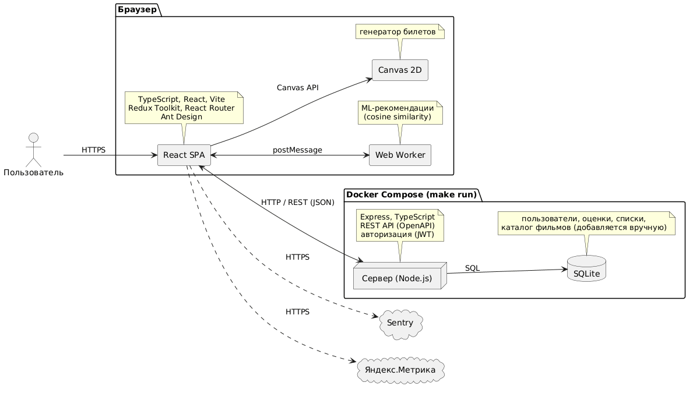

# Vie

Веб-приложение для оценки фильмов в стилистике ретро-кинотеатра: каталог, личные оценки, списки просмотренного и рекомендации. Курсовая работа по предмету «Веб-программирование» (ИТМО).

- Репозиторий: <https://github.com/arthkinq/Vie>
- Таск-трекер: <https://github.com/users/arthkinq/projects/4>
- Макеты: <https://www.figma.com/design/5ntpPvWoYsYVSAqyhdnwxb/web-design--Copy-?node-id=0-1&t=C1ZVekFI21fSmAnp-1>

## Что умеет приложение

1. Каталог фильмов. Фильмы добавляются в базу данных вручную.
2. Регистрация и вход. Оценки (от 1 до 10) и списки «Просмотрено» и «Хочу посмотреть» хранятся для каждого пользователя.
3. Рекомендации. Считаются в браузере в Web Worker по косинусному сходству между оценками пользователя и фильмами.
4. Генератор билетов. Рисует ретро-билет на Canvas, который можно скачать.

## Архитектура



Исходник схемы: [docs/G2_1.puml](docs/G2_1.puml).

## Стек

| Область | Технологии |
| --- | --- |
| Клиент | TypeScript, React, Vite |
| Состояние и роутинг | Redux Toolkit, React Router |
| UI | Ant Design |
| Unit-тесты | Vitest, Testing Library, покрытие через v8 |
| E2E-тесты | Playwright |
| Качество кода | ESLint, Prettier, Stylelint |
| CI | GitHub Actions |
| Web Worker и Canvas API | рекомендации и генератор билетов |
| Сервер | Node.js, Express, TypeScript, REST API (OpenAPI), JWT |
| База данных | SQLite |
| Запуск | Docker Compose, `make run` |
| Аналитика и ошибки | Яндекс.Метрика, Sentry |

### Описание архитектуры и взаимодействия

* **Модули и технологии:**
  * **Клиент:** React, Vite, Redux Toolkit, React Router, Ant Design. Отвечает за интерфейс, навигацию и состояние приложения.
  * **Web Worker:** изолированный фоновый поток для расчёта рекомендаций без блокировки интерфейса.
  * **Canvas 2D:** генерация изображения ретро-билета средствами Canvas API.
  * **Сервер (Node.js):** сервис на Express и TypeScript, реализующий REST API (контракт OpenAPI) и авторизацию по JWT.
  * **База данных:** SQLite для хранения пользователей, оценок и каталога фильмов.
  * **Мониторинг:** Sentry (логирование ошибок) и Яндекс.Метрика (аналитика).

* **Связи и протоколы:**
  * **SPA ↔ Web Worker (`postMessage`):** передача оценок пользователя в воркер и получение отсортированного списка рекомендаций.
  * **SPA → Canvas 2D (`Canvas API`):** вызовы контекста отрисовки и сохранение билета в PNG.
  * **SPA ↔ Сервер (`HTTP / REST (JSON)`):** получение каталога, отправка оценок и авторизация (заголовок `Authorization: Bearer <JWT>`).
  * **Сервер ↔ БД (`SQL`):** сохранение и выборка данных.
  * **SPA → Sentry / Метрика (`HTTPS`):** асинхронная отправка ошибок и аналитики.

## CI и правила работы с репозиторием

Ветка `main` защищена, напрямую в неё пушить нельзя. Изменения попадают в `main` только через Pull Request. Подробности в [CONTRIBUTING.md](CONTRIBUTING.md).

Для каждого PR запускается [CI](.github/workflows/ci.yml). Merge заблокирован, пока все проверки не пройдут:

| Проверка | Что делает |
| --- | --- |
| `lint` | ESLint, Prettier, Stylelint |
| `unit` | unit-тесты |
| `coverage` | покрытие unit-тестами не ниже 80% |
| `e2e` | e2e-тесты в Playwright |

## Структура репозитория

```
client/      фронтенд (React + Vite)
docs/        схема архитектуры
.github/     CI и шаблон Pull Request
```

Папка `server/` появится вместе с серверной частью.

## Команда

| Участник         | Роль / Зона ответственности |
|------------------|-----------------------------|
| **Артур (Lead)** | Архитектура, Бэкенд, Воркер |
| **Вика (CTO)**   | Стейт, Роутинг, Тесты |
| **Юля (CEO)**    | UI-компоненты, Аналитика    |
| **Алина (COO)**  | Стили, Анимации, Лейаут     |
